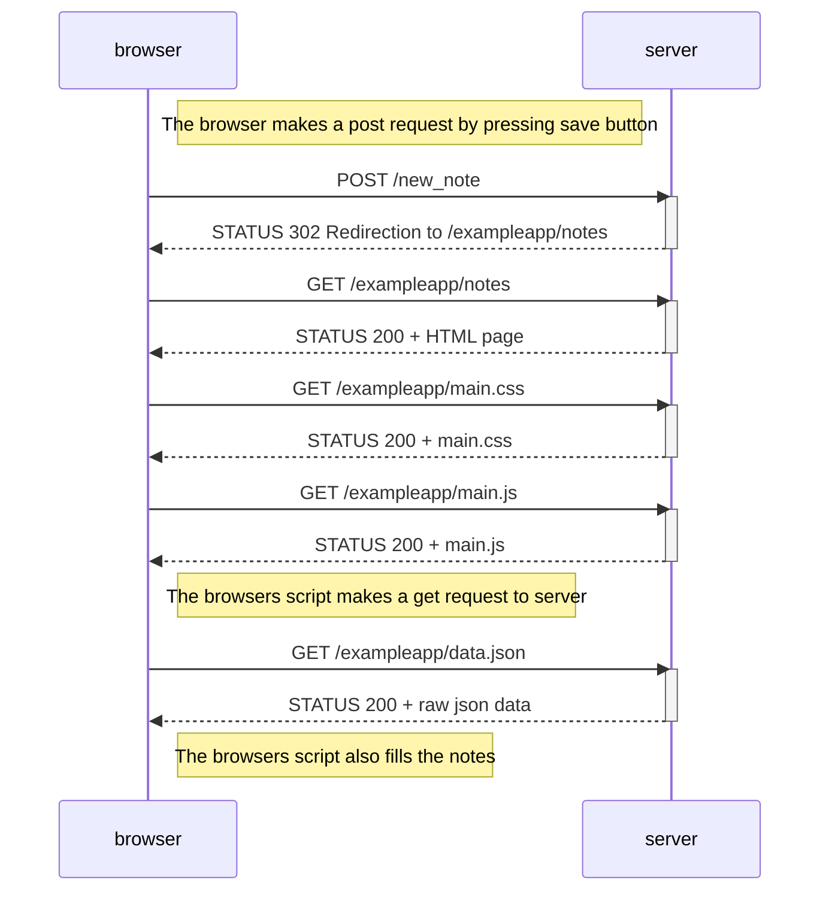

```mermaid
sequenceDiagram
  participant browser
  participant server

  Note right of browser: The browser makes a post request by pressing save button
  browser->>server: POST /new_note
  activate server
  server-->>browser: STATUS 302 Redirection to /exampleapp/notes
  deactivate server

  browser->>server: GET /exampleapp/notes
  activate server
  server-->>browser: STATUS 200 + HTML page
  deactivate server

  browser->>server: GET /exampleapp/main.css
  activate server
  server-->>browser: STATUS 200 + main.css
  deactivate server

  browser->>server: GET /exampleapp/main.js
  activate server
  server-->>browser: STATUS 200 + main.js
  deactivate server

  Note right of browser: The browsers script makes a get request to server
  browser->>server: GET /exampleapp/data.json
  activate server
  server-->>browser: STATUS 200 + raw json data
  deactivate server
  Note right of browser: The browsers script also fills the notes
```
