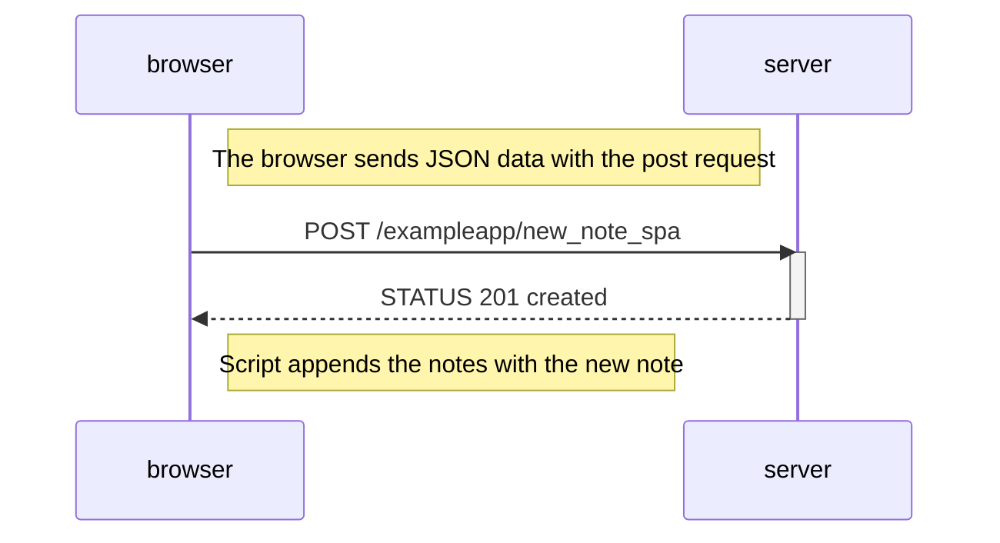

```mermaid
sequenceDiagram
  participant browser
  participant server

  Note right of browser: The browser sends JSON data with the post request
  browser->>server: POST /exampleapp/new_note_spa
  activate server
  server-->>browser: STATUS 201 created
  deactivate server
  Note right of browser: Script appends the notes with the new note
```
